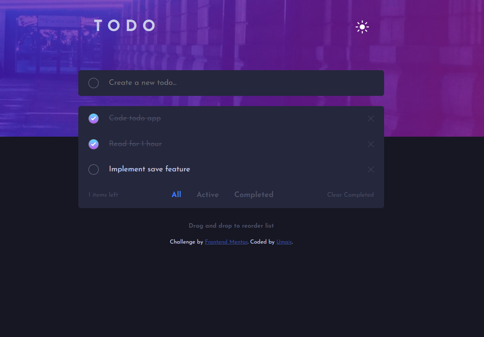

# Frontend Mentor - Todo app solution

This is a solution to the [Todo app challenge on Frontend Mentor](https://www.frontendmentor.io/challenges/todo-app-Su1_KokOW). Frontend Mentor challenges help you improve your coding skills by building realistic projects. 

## Table of contents

- [Overview](#overview)
  - [The challenge](#the-challenge)
  - [Screenshot](#screenshot)
  - [Links](#links)
- [My process](#my-process)
  - [Built with](#built-with)
  - [What I learned](#what-i-learned)
  - [Continued development](#continued-development)
  - [Useful resources](#useful-resources)
- [Author](#author)
- [Acknowledgments](#acknowledgments)

## Overview

### The challenge

Users should be able to:

- View the optimal layout for the app depending on their device's screen size
- See hover states for all interactive elements on the page
- Add new todos to the list
- Mark todos as complete
- Delete todos from the list
- Filter by all/active/complete todos
- Clear all completed todos
- Toggle light and dark mode
- **Bonus**: Drag and drop to reorder items on the list. Under development.

### Screenshot

### Links

- Solution URL: [GitHub Link](https://github.com/umairanwer/fem-todo-app)
- Live Site URL: [Live site](https://umairanwer.github.io/fem-todo-app/)

## My process

### Built with

- Semantic HTML5 markup
- CSS custom properties
- Flexbox
- Mobile-first workflow
- Vanilla JS

### What I learned

This project helped me in getting a lot of practice for DOM manipulation, storing and retreiving data, implementing dark/ light theme and some other techniques.

### Continued development

- Drag and drop feature
- Saving and retreiving from local storage

## Author

- Website - [Add your name here](https://www.your-site.com)
- Frontend Mentor - [@umairanwer](https://www.frontendmentor.io/profile/umairanwer)
- Twitter - [@yourusername](https://www.twitter.com/yourusername)
